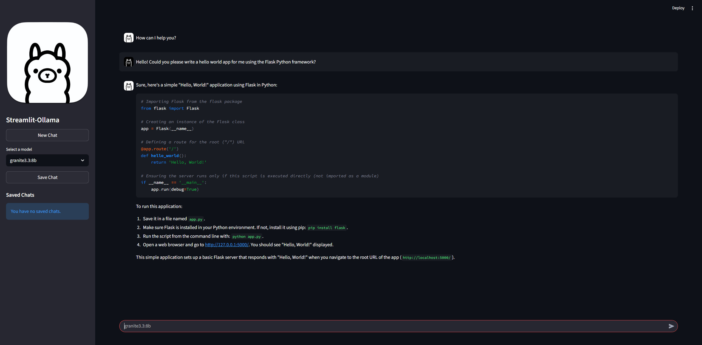

# Streamlit-Ollama

Streamlit-Ollama is a simple, self-hostable AI chat application that uses Streamlit for a minimal UI with Ollama as the model server. The project focuses on simplicity and configurability — you can point the app at a local or remote Ollama host via a single configuration constant.



## Requirements

- Python 3.12+
- Ollama server reachable at the configured host
- See project dependencies in the [pyproject.toml](pyproject.toml) file
- Docker (optional)

## Quickstart — clone, install, and run locally

> ✋ This Quickstart assumes that you are serving Ollama from your `localhost` to run out of the box. If you are hosting Ollama externally, please be sure to read the [Configuration and Customization](#configuration-and-customiztion) section of this page before running the app.

1. Clone and enter the repository:

```sh
git clone https://github.com/forgineer/streamlit-ollama.git
cd streamlit-ollama
```

2. Create a virtual environment and install:

```sh
# On MacOS/Linux...
python3 -m venv .venv
source .venv/bin/activate 

# On Windows (powershell)...
# python -m venv .venv
# .venv\Scripts\activate

pip install .   # Installs all Python related dependencies
```

3. Run the app locally:

```sh
streamlit run src/app.py --server.port=8501
```

Open http://localhost:8501 in your browser to start using the app! Starting the server will also create a local `data` directory with a `streamlit-ollama.db` SQLite file for storing any saved chat conversations.

## Configuration and Customization

Out of the box, the app is configured to look for Ollama being served locally (or `localhost`). This is primarily for quick setup with Docker on the same server where Ollama might be running. However, if Ollama isn't running locally, you will need to configure the app to look externally.

All available configurations and customizations can be made in the [config.py](src/config.py) file. Most notably, the `STREAMLIT_OLLAMA_HOST` variable that points to the exposed Ollama service.

## Run with Docker

Streamlit-Ollama shines best when running as a Docker container since Streamlit apps, by their nature, are meant for deployments to the cloud. However, this project leaves the container build and deployment up to you. I have tried to make this as easy as possible though.

Assuming you are remotely logged into your server and have followed the first step of cloning and navigating to the `streamlit-ollama` directory (see Quickstart) these next two commands should help you build and run the container.

> ✋ Prior to building your container, ensure that any additional configurations or customizations are finalized.

Build the image:
```sh
docker build -t streamlit-ollama .
```

Run the container:
```sh
docker run -d --restart=unless-stopped --network host -p 8501:8501 -v "$(pwd)/data:/streamlit-ollama/data" streamlit-ollama
```

## Troubleshooting

- If the app cannot reach the Ollama service, verify the configured host URL ([`STREAMLIT_OLLAMA_HOST`](src/config.py)) and network connectivity. If you are accessing Ollama externally you should also ensure that the Ollama service is accessable from the network (eg. `OLLAMA_HOST=0.0.0.0`).

## Disclaimers and Contributing

This project is meant for simplicity and offer a more private and self-hosted oriented option among the MANY other AI clients out there (ex. Open WebUI). In its current form it is not well secured or highly scalable and I would advise AGAINST exposing this app outside of your home network.

All current and future features will likely continue to center around simplicity and only offer features that make it easier to interface with Ollama with the out of the box features of Streamlit (without custom components). With that in mind, Contributions (or Issues logged) are welcome through forking and pull requests.
